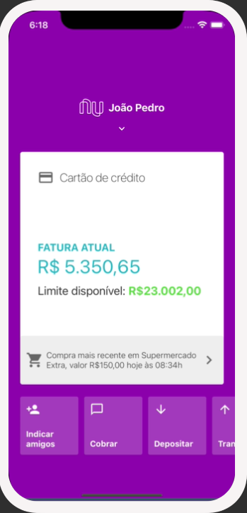

<h1 align="center">
    
</h1>

<div align="center">
   <a href="https://github.com/JohnPetros">
      
   </a>
   
   
   <a href="https://github.com/JohnPetros/nubank-ui-clone/commits/main">
      
   </a>
  </a>
   </a>
   <a href="https://github.com/JohnPetros/nubank-ui-clone/blob/main/LICENSE.md">
      
   </a>
    
</div>

<br>

<p align="center">
  <a href="#-projeto">Projeto</a>&nbsp;&nbsp;&nbsp;|&nbsp;&nbsp;&nbsp;
  <a href="#-funcionalidades">Funcionalidades</a>&nbsp;&nbsp;&nbsp;|&nbsp;&nbsp;&nbsp;
  <a href="#-aprendizado">Aprendizado</a>&nbsp;&nbsp;&nbsp;|&nbsp;&nbsp;&nbsp;
  <a href="#-tecnologias">Tecnologias</a>&nbsp;&nbsp;&nbsp;|&nbsp;&nbsp;&nbsp;
  <a href="#-instalação-e-execução">Instalação e execução</a>&nbsp;&nbsp;&nbsp;|&nbsp;&nbsp;&nbsp;
  <a href="#-licença">Licença</a>
</p>

## 🖥️ Projeto

Recriação da interface do Nubank com animações para fins de estudos.

### Demonstração
<div align="center">
    
    

</div>
<hr>

<!-- 
 -->
## ✨ Funcionalidades

- Listagem de opções de conta de forma horizontal
- Geração de QRCode
- Animações de arrastagem, fadeOut e translado
- Exibição do nome do cliente e saldo disponível

## 📖 Aprendizado

- Animações com React Native usando a API Animated
- Forma simplicada de usar react navigation para renderizar uma tela
- Uso da biblioteca react-native-iphone-x-helper para auxiliar na criação de interfaces no iPhone
- Geração de QRCode personalizados usando a biblioteca react-native-qrcode
- Como fazer estilização interna na ScrollView
- Como lidar com touch handling nativo de forma performática usando a biblioteca React Native Gesture Handler
- Como renderizar uma linha do tamanho de um fio de cabelo com a API StyleSheet

## 🚀 Tecnologias

Esse projeto foi desenvolvido com as seguintes tecnologias:

#### **Mobile** ([React Native](http://www.reactnative.com/))

- **[Expo](https://expo.io/)**
- **[React Native Vector Icons](https://oblador.github.io/react-native-vector-icons/)**
- **[React Native Gesture Handler](https://docs.swmansion.com/react-native-gesture-handler/docs/)**
- **[React Native Iphone X-Helper](https://github.com/ptelad/react-native-iphone-x-helper)**
- **[React Native QRCode](https://www.npmjs.com/package/react-native-qrcode-scanner)**
- **[React Navigation](https://reactnavigation.org/)**
- **[React Native SVG](https://github.com/react-native-community/react-native-svg)**

## Instalação e execução

### Pré-requesitos

Antes de baixar o projeto você vai precisar ter instalado na sua máquina as seguintes ferramentas:

- [Git](https://git-scm.com)
- [NodeJS](https://nodejs.org/en/)
- [Yarn](https://yarnpkg.com/) ou [NPM](https://www.npmjs.com/)

Além disto é bom ter um editor para trabalhar com o código como [VSCode](https://code.visualstudio.com/)<br>4

> Você poder executar o App no seu celular ou em um emulador de celular da sua preferência usando Expo.

#### 📟 Rodando o Mobile

```bash
# Clone este repositório
$ git clone  https://github.com/JohnPetros/nlw-copa.git

# Acesse a pasta do projeto no terminal/cmd
$ cd nubank-ui-clone

# Instale as dependências
$ npm install

# Execute a aplicação em modo de desenvolvimento
$ npx expo start

```
---

## :memo: Licença

Esse projeto está sob a licença MIT. Veja o arquivo [LICENSE](LICENSE) para mais detalhes.

---

Feito com 💜 by João Pedro 👋🏻
